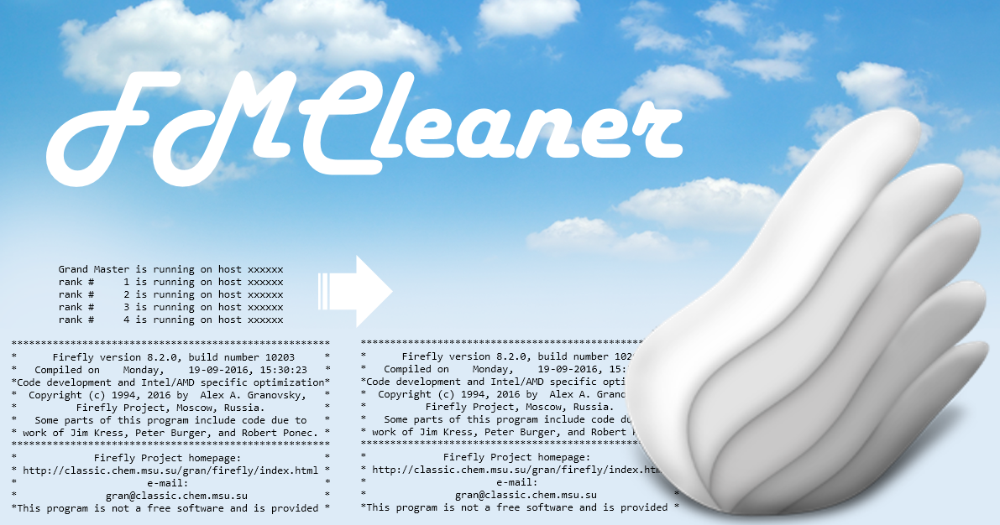

# FMCleaner

Support software for MaSK.  
(MaSK is software that visualizes the molecular properties calculated by Firefly.)  
For more details on FMCleaner, please go to [hhttp://pc-chem-basics.blog.jp/archives/26827834.html](http://pc-chem-basics.blog.jp/archives/26827834.html)
